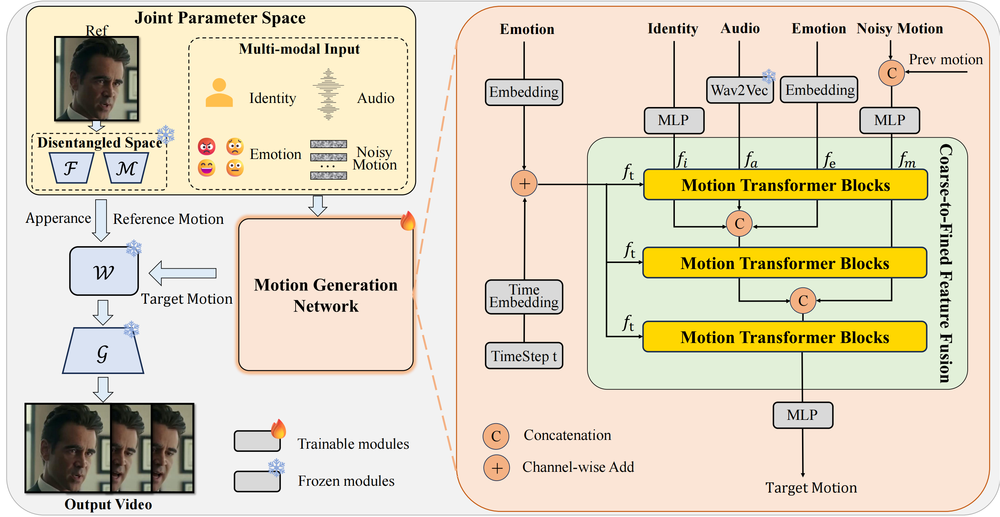

# MoDA: Multi-modal Diffusion Architecture for Talking-Head Generation

  <video width="100%" controls>
    <source src="moda/moda.mp4" type="video/mp4">
  </video>

---

## Abstract

  

Talking-head generation with arbitrary identities and speech audio remains a crucial problem in the virtual-metaverse domain.  
Despite recent progress, existing methods still struggle to:

* synthesize diverse facial expressions,  
* create natural head movements, **and**  
* keep lip motions perfectly synchronized with speech.

The core challenge is the stylistic discrepancy across three modalities: speech audio, the person’s identity, and portrait dynamics.

To tackle these inconsistencies we introduce **MoDA**, a multi-modal diffusion architecture featuring two key techniques:

1. **Explicit Cross-Modal Interaction**  
   MoDA jointly models motion, audio, and auxiliary cues (e.g. emotion and identity) via a Multi-modal Diffusion Transformer (MMDiT [Esser *et al.* 2024]) equipped with rectified flow [Liu *et al.* 2022].  
   This design lets audio features adapt dynamically to motion, identity, and emotion, boosting motion accuracy.

2. **Coarse-to-Fine Fusion**  
   * **Stage 1 – Coarse.** Maintain separate parameters for each modality to keep their unique traits.  
   * **Stage 2 – Intermediate.** Project semantically related modalities (audio, emotion, identity) into a shared latent space to form a unified motion command.  
   * **Stage 3 – Fine.** Merge every modality into one common space for holistic fusion.  

   To further ensure precise lip-sync while retaining motion diversity, we introduce an optional **Adaptive Lip-motion Sync Expert (ALSE)** that plugs into training.

**Experimental results** show that MoDA improves video diversity, realism, and efficiency, making it well-suited for real-world applications.

---

## Gallery

### Qualitative Evaluation

<table>
  <tr>
    <!-- Each <td> is 14.28% width ≈ 1/7; adjust if needed -->
    <td width="14.28%">
      
<strong>MoDA</strong>

      <video width="100%" controls><source src="moda/compara5/our.mp4"   type="video/mp4"></video>
      <video width="100%" controls><source src="moda/compare4/our.mp4"    type="video/mp4"></video>
      <video width="100%" controls><source src="moda/compare/moda.mp4"    type="video/mp4"></video>
      <video width="100%" controls><source src="moda/compare2/moda.mp4"   type="video/mp4"></video>
      <video width="100%" controls><source src="moda/compare3/moda.mp4"   type="video/mp4"></video>
    </td>

    <td width="14.28%">
      
<strong>EchoMimic</strong>

      <video width="100%" controls><source src="moda/compara5/ec.mp4"     type="video/mp4"></video>
      <video width="100%" controls><source src="moda/compare4/ec.mp4"     type="video/mp4"></video>
      <video width="100%" controls><source src="moda/compare/ec.mp4"      type="video/mp4"></video>
      <video width="100%" controls><source src="moda/compare2/ech.mp4"    type="video/mp4"></video>
      <video width="100%" controls><source src="moda/compare3/ech.mp4"    type="video/mp4"></video>
    </td>

    <td width="14.28%">
      
<strong>HALO-2</strong>

      <video width="100%" controls><source src="moda/compara5/hallo2.mp4" type="video/mp4"></video>
      <video width="100%" controls><source src="moda/compare4/hallo2.mp4" type="video/mp4"></video>
      <video width="100%" controls><source src="moda/compare/hallo2.mp4"  type="video/mp4"></video>
      <video width="100%" controls><source src="moda/compare2/hallo2.mp4" type="video/mp4"></video>
      <video width="100%" controls><source src="moda/compare3/hallo2.mp4" type="video/mp4"></video>
    </td>

    <!-- Repeat the same pattern for the remaining four columns (Halo, JoyHalo, JoyVASA, Ditto) -->
  </tr>
</table>

---

### Talking-Head Generation in Complex Scenarios

<table>
  <tr>
    <td><video width="100%" controls><source src="moda/Complex Scenarios/1.mp4" type="video/mp4"></video></td>
    <td><video width="100%" controls><source src="moda/Complex Scenarios/2.mp4" type="video/mp4"></video></td>
    <td><video width="100%" controls><source src="moda/Complex Scenarios/3.mp4" type="video/mp4"></video></td>
  </tr>
  <tr>
    <td><video width="100%" controls><source src="moda/Complex Scenarios/4.mp4" type="video/mp4"></video></td>
    <td><video width="100%" controls><source src="moda/Complex Scenarios/5.mp4" type="video/mp4"></video></td>
    <td><video width="100%" controls><source src="moda/Complex Scenarios/6.mp4" type="video/mp4"></video></td>
  </tr>
  <tr>
    <td><video width="100%" controls><source src="moda/Complex Scenarios/7.mp4" type="video/mp4"></video></td>
    <td><video width="100%" controls><source src="moda/Complex Scenarios/8.mp4" type="video/mp4"></video></td>
    <td><video width="100%" controls><source src="moda/Complex Scenarios/9.mp4" type="video/mp4"></video></td>
  </tr>
</table>

---

### Fine-grained Emotion Control

<table>
  <tr>
    <td width="50%">
      
<strong>Happy</strong>

      <video width="100%" controls><source src="moda/Emotion Control/1-1.mp4" type="video/mp4"></video>
    </td>
    <td width="50%">
      
<strong>Sad</strong>

      <video width="100%" controls><source src="moda/Emotion Control/1-2.mp4" type="video/mp4"></video>
    </td>
  </tr>
  <tr>
    <td width="50%">
      
<strong>Happy</strong>

      <video width="100%" controls><source src="moda/Emotion Control/2-1.mp4" type="video/mp4"></video>
    </td>
    <td width="50%">
      
<strong>Sad</strong>

      <video width="100%" controls><source src="moda/Emotion Control/2-2.mp4" type="video/mp4"></video>
    </td>
  </tr>
</table>

---

### Long-form Video Generation

<table>
  <tr>
    <td width="50%"><video width="100%" controls><source src="moda/Long Videos Generation/1.mp4" type="video/mp4"></video></td>
    <td width="50%"><video width="100%" controls><source src="moda/Long Videos Generation/2.mp4" type="video/mp4"></video></td>
  </tr>
</table>

---

### Ablation Study

<table>
  <tr>
    <td width="25%">
      
<strong>MoDA</strong>

      <video width="100%" controls><source src="moda/Ablation Study/moda.mp4" type="video/mp4"></video>
    </td>
    <td width="25%">
      
<strong>+ CABA</strong>

      <video width="100%" controls><source src="moda/Ablation Study/wcaba.mp4" type="video/mp4"></video>
    </td>
    <td width="25%">
      
<strong>Replace Audio</strong>

      <video width="100%" controls><source src="moda/Ablation Study/audio.mp4" type="video/mp4"></video>
    </td>
    <td width="25%">
      
<strong>Replace Image</strong>

      <video width="100%" controls><source src="moda/Ablation Study/image.mp4" type="video/mp4"></video>
    </td>
  </tr>
</table>

---

Page Views: 
